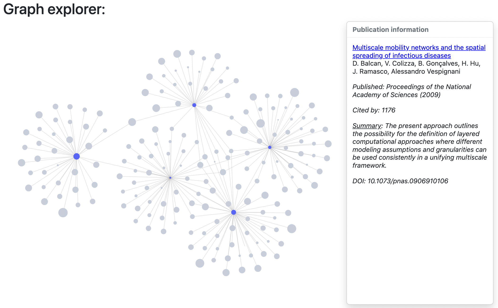
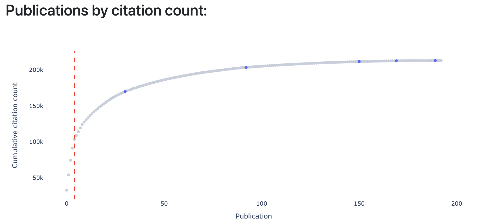

# Literature Review Graph

## Overview

`lit_review_graph` helps you find papers that make you say: "How could I have missed this??"

`lit_review_graph` is similar to [ResearchRabbit](https://researchrabbitapp.com/home) or [Connected Papers](https://www.connectedpapers.com/) but runs locally and displays the complete reference network for papers in your bibliography.

*Explore publications in a connected network:*



*Find the papers which make up the majority of citations in the network:*



*PLUS: Find the publications that are highly cited and closely connected to papers in your bibliography.*

## Installation

Clone this repository:

```
git clone https://github.com/hamishgibbs/lit_review_graph.git
cd lit_review_graph
```

Create a new virtual environment and install required dependencies:

```
python -m venv env
source env/bin/activate 
pip install -r requirements.txt
```

## Usage

Create a text file with a series of DOIs:

`bibliography.txt`
```
10.1038/s41586-020-2909-1
10.1140/epjds/s13688-015-0059-8
10.1038/nature06958
10.1038/nature04292
10.1038/srep00457
10.1093/infdis/jiw273
10.1126/science.286.5439.509
```

Run the app and point it to your bibliography:

```
python src/app.py bibliography.txt
```

Navigate to the app in your browser: 

```
http://127.0.0.1:8050/
```

## Limitations

`lit_review_graph` searches all of the references of papers in your bibliography and will struggle with a large network. I recommend dividing your references into small groups (around 5-25 publications) for the most clarity.

When adding a new paper, `lit_review_graph` may take some time to query the metadata for each of the connected references from [Semantic Scholar](https://www.semanticscholar.org/). Requests are cached in `lit_review_graph_cache.sqlite` and start-up will be faster after papers have been downloaded.

[Semantic Scholar](https://www.semanticscholar.org/) is a great free resource for citation data but information for some papers (particularly older papers) may be missing or incomplete. 

## Issues

Contributions are welcome. 

If you encounter an error, please open an [issue](https://github.com/hamishgibbs/lit_review_graph/issues/new/choose) and if possible, include the DOIs used to seed your graph. This will make it easier to identify issues with data coming from Semantic Scholar.

To debug the app, you can also inspect `get_metadata.log` for any papers that failed to download, or re-download papers by deleting `lit_review_graph_cache.sqlite`. 